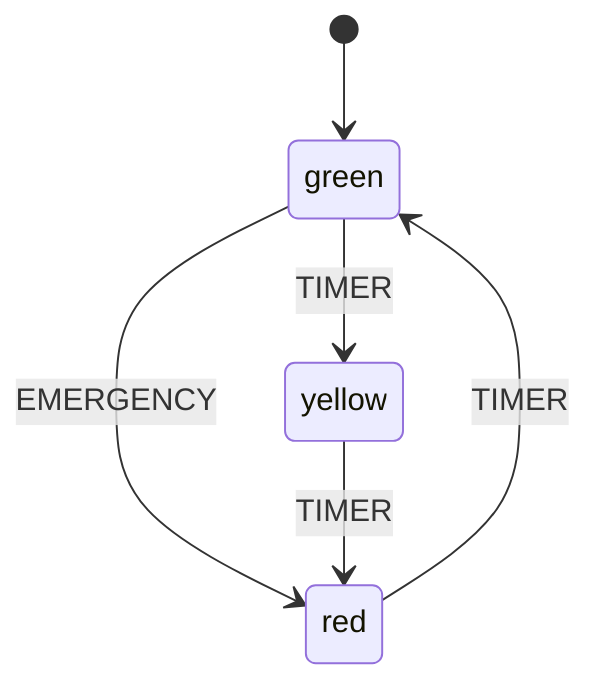

# state-machine-lib


A finite state machine library for TypeScript. Zero dependencies. Type-safe. With built-in guards, actions, and diagram visualization.

## What is a Finite State Machine?

A finite state machine (FSM) is a mathematical model of computation. It consists of:

- A finite set of **states** (e.g., `idle`, `loading`, `error`)
- A finite set of **events** (e.g., `FETCH`, `SUCCESS`, `FAILURE`)
- A **transition function** that maps (state, event) to a new state
- An **initial state**
- Optionally, **context** (extended state) for storing arbitrary data

State machines prevent impossible states, make state logic explicit, and are easy to visualize and test.

## Features

- **Type-safe** - Full TypeScript support with generics
- **Guards** - Conditional transitions based on context or event data
- **Actions** - Side effects on transitions, entry, and exit
- **Context** - Extended state (arbitrary data) updated via actions
- **Interpreter** - Event queue, async support, error handling
- **Child machines** - Spawn and forward events to sub-machines
- **Visualization** - Generate Mermaid, ASCII, and Graphviz DOT diagrams
- **Zero dependencies** - Only TypeScript as a dev dependency

## Installation

```bash
npm install
npm run build
```

## Quick Start

```typescript
import { StateMachine } from './src/Machine';

const toggle = new StateMachine({
  id: 'toggle',
  initial: 'inactive',
  states: {
    inactive: {
      on: { TOGGLE: 'active' },
    },
    active: {
      on: { TOGGLE: 'inactive' },
    },
  },
});

toggle.start();
console.log(toggle.state); // 'inactive'

toggle.send('TOGGLE');
console.log(toggle.state); // 'active'

toggle.send('TOGGLE');
console.log(toggle.state); // 'inactive'
```

## State Diagram (Mermaid)

The library can generate Mermaid diagrams from any machine config:



## API Reference

### `StateMachine`

The core state machine class.

```typescript
const machine = new StateMachine(config);
```

| Method | Description |
|--------|-------------|
| `start()` | Start the machine, run initial entry actions |
| `send(event)` | Send an event (string or `{ type, payload }`) |
| `can(eventType)` | Check if an event would trigger a transition |
| `matches(state)` | Check if machine is in a given state |
| `getSnapshot()` | Get current state, context, history |
| `subscribe(fn)` | Listen for state changes (returns unsubscribe fn) |
| `getContext()` | Get current context data |
| `getHistory()` | Get array of all visited states |

### `Interpreter`

Manages a running machine with event queuing and error handling.

```typescript
const interpreter = new Interpreter(config, options?);
```

| Method | Description |
|--------|-------------|
| `start()` | Start the interpreter |
| `stop()` | Stop and clear event queue |
| `send(event)` | Queue an event for processing |
| `sendDelayed(event, ms)` | Send event after delay |
| `subscribe(fn)` | Listen for state changes |
| `onError(fn)` | Register error handler |
| `spawn(id, config)` | Create a child interpreter |
| `getSnapshot()` | Get current snapshot |
| `getEventHistory()` | Get processed event history |
| `isRunning()` | Check if interpreter is active |

### Guards

Built-in guard functions for conditional transitions.

```typescript
import { equals, not, and, or, greaterThan, lessThan, contains, matches, guard } from './src/guards';

// Usage in transition config
{
  target: 'next',
  guard: and(
    greaterThan('score', 100),
    not(equals('banned', true))
  )
}
```

| Guard | Description |
|-------|-------------|
| `equals(prop, value)` | Context property equals value |
| `not(guard)` | Negate a guard |
| `and(...guards)` | All guards must pass |
| `or(...guards)` | At least one guard must pass |
| `greaterThan(prop, n)` | Context number > n |
| `lessThan(prop, n)` | Context number < n |
| `contains(prop, value)` | Array/string contains value |
| `matches(prop, regex)` | String matches regex |
| `guard(fn)` | Custom guard from function |

### Actions

Built-in actions for state transitions.

```typescript
import { assign, log, send, raise, pure, choose } from './src/actions';
```

| Action | Description |
|--------|-------------|
| `assign(obj or fn)` | Update context with new values |
| `log(msg or fn)` | Log a message to console |
| `send(event, delay?)` | Self-send a delayed event |
| `raise(event)` | Raise event for immediate processing |
| `pure(fn)` | Conditionally return actions |
| `choose(candidates)` | Pick first matching guarded action set |

### Visualization

```typescript
import { generateMermaid, generateAscii, generateDot } from './src/visualizer';

// Mermaid (for Markdown / live editor)
console.log(generateMermaid(config));

// ASCII (for terminal)
console.log(generateAscii(config));

// Graphviz DOT (render with `dot -Tpng`)
console.log(generateDot(config));
```

## Examples

### Traffic Light

```typescript
// green -> yellow -> red -> green (cycle)
// See examples/trafficLight.ts

npm run example:traffic
```

### Authentication Flow

```typescript
// idle -> authenticating -> authenticated / error -> idle
// See examples/auth.ts

npm run example:auth
```

## Machine Config Structure

```typescript
interface MachineConfig {
  id: string;          // Machine identifier
  initial: string;     // Initial state name
  context?: object;    // Initial context data
  states: {
    [stateName: string]: {
      on?: {             // Event handlers
        [eventName: string]: string | {
          target: string;       // Target state
          guard?: Guard;        // Condition for transition
          actions?: Action[];   // Side effects
          description?: string; // For visualization
        }
      };
      entry?: Action | Action[];  // Run on state entry
      exit?: Action | Action[];   // Run on state exit
      type?: 'atomic' | 'final'; // State type
      meta?: object;              // Metadata
    }
  }
}
```

## Project Structure

```
state-machine-lib/
  src/
    index.ts          Public API exports
    types.ts          TypeScript type definitions
    Machine.ts        Core StateMachine class
    Interpreter.ts    Event queue and async support
    guards.ts         Built-in guard functions
    actions.ts        Built-in action functions
    visualizer.ts     Mermaid, ASCII, DOT generators
    utils.ts          Helper utilities
  examples/
    trafficLight.ts   Traffic light FSM example
    auth.ts           Auth flow FSM example
  dist/               Compiled output (git ignored)
```

## License

MIT

## Testing

Run `npm test` to execute the test suite.

---

## 🇫🇷 Documentation en français

### Description
state-machine-lib est une bibliothèque de machines à états finis pour TypeScript, sans dépendances externes. Elle offre un typage fort, des guards, des actions et une visualisation de diagrammes intégrée. Parfaite pour modéliser des workflows complexes de manière claire et maintenable.

### Installation
```bash
npm install
```

### Utilisation
```typescript
import { createMachine } from 'state-machine-lib';

const machine = createMachine({ /* votre config */ });
machine.send('EVENT');
```
Consultez la documentation en anglais ci-dessus pour les exemples complets et l'API détaillée.
